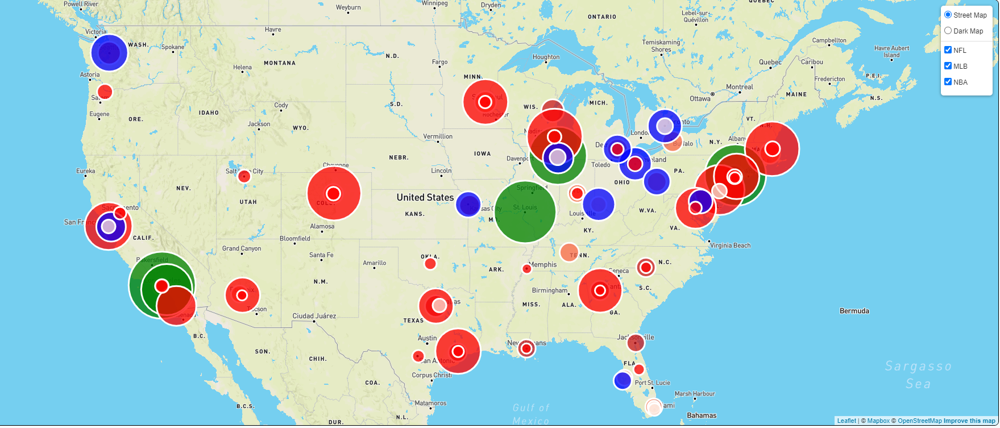
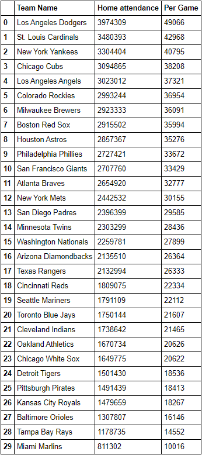
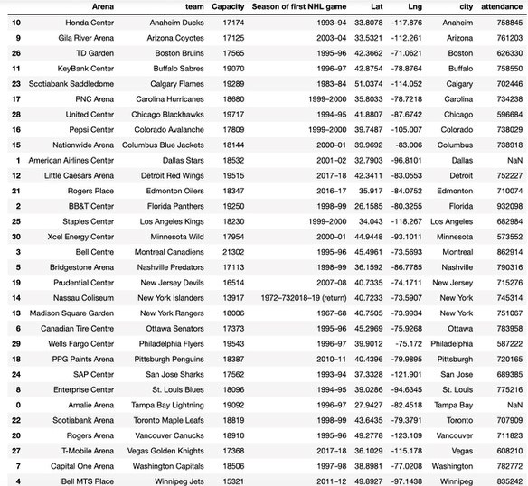
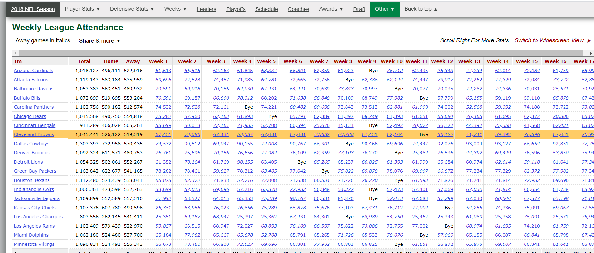
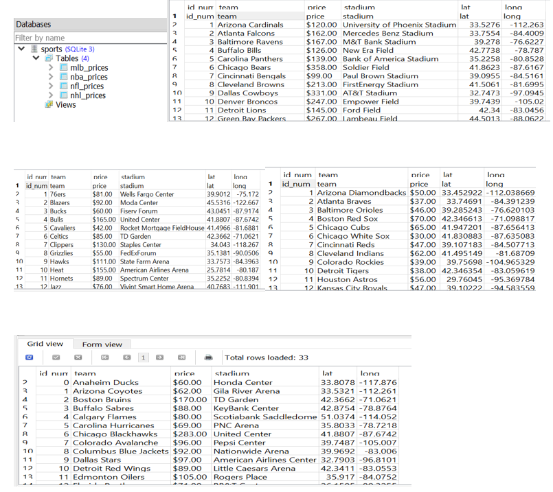

# Sports Popularity

# **Summary of Interests and Intent**

Major league sports are an integral part of many American lives. However, not all sports are equally popular in all cities. For example, the Green Bay Packers are a wildly successful football team in Wisconsin, but Wisconsin has no NHL team and no corresponding popularity of major league hockey. We are interested in analyzing the relative popularity of each of the “Big 4” sports, (hockey, baseball, football, and basketball) in major American cities and unearthing patterns in where some sports are more or less popular than others. On this large scale, we will use seasonwide attendance to games as a metric to score relative popularity; and we will also compare average ticket prices for teams' games across the four sports. Due to the implications of the Coronavirus pandemic, our professional sport teams' season data will be accesd from the 2018 and 2019 seasons. It's important to note that some sports have seasons that span across two calendar years, such as the hockey, basketball and football seasons.

# **Data Sources**

Sports season-wide attendance data is relatively easily to find across the internet. To access this data, we will be using a series of web-scraping techniques, including but not limted to python's Pandas library and Beautiful Soup. 
For our baseball attendance data, we will be scraping the [Wikipedia article](https://en.wikipedia.org/wiki/2019_Major_League_Baseball_season) 2019 Major League Baseball Season to access data on the 2019 Major League Baseball season, as well as a [JSON of ballparks' locations](https://tinyurl.com/y3sby4ur) to accurately place the ballparks on our leaflet map. 
For the hockey attendance data we will be referencing ESPN's aggregate of the [2018-2019 hockey season](http://www.espn.com/nhl/attendance/_/year/2019), and the [Wikipedia list](https://en.wikipedia.org/wiki/List_of_National_Hockey_League_arenas) of all professional hockey arenas.
For the football attendance data we scraped Pro-Football-Reference's [data](https://www.pro-football-reference.com/years/2018/attendance.htm) on the 2018-2019 football season, and a [list](https://www.stadiumsofprofootball.com/comparisons/) of every professional football stadium.
For the basketball attendance data we accessed [ESNP's data](http://www.espn.com/nba/attendance/_/year/2019) for the 2018-2019 season, as well as the [Wikipedia list](https://en.wikipedia.org/wiki/List_of_National_Basketball_Association_arenas) of the professional basketball arenas.
For the ticket price data we utilzed the data from several sources and aggregated them into a single csv. The [MLB](https://www.tickpick.com/blog/how-much-are-mlb-tickets/) and [NFL](https://www.tickpick.com/blog/how-much-are-nfl-tickets/) ticket price data came from TickPick Blog. The [NBA's](https://finance.yahoo.com/news/average-ticket-prices-nba-team-100000563.html) ticket price data came from a Yahoo Finance article, and the [NHL's](https://www.vividseats.com/blog/nhl-team-rankings-by-median-ticket-price) ticket price data came from a VividSeats blog post.
## Baseball Attendance

Using the [Wikipedia article](https://en.wikipedia.org/wiki/2019_Major_League_Baseball_season) and the [JSON of ballparks' locations](https://tinyurl.com/y3sby4ur) we were able to collect the attendance data for MLB teams and place the ballpark locations on a leaflet map for further analysis. In analzying the data, there are some interesting trends to note. In a way, the MLB attenddance data acts almost as a low-granularity population heatmap of the nation; the highest attended teams are centralized in the mid-atlantic through southern new england; southern California, and in the eastern mid-west. With the exception of the [Rockies](https://www.mlb.com/rockies) in Denver, Colorado and the [Diamondbacks](https://www.mlb.com/dbacks) in Phoenix, Arizona, there is lack of MLB teams in the mountain-west region of the United States; especially when compared to the density of teams in other regions of the nation.
## Hockey Attendance

Using the [ESPN data](http://www.espn.com/nhl/attendance/_/year/2019) for the 2018-2019 NHL season and the [Wikipedia list](https://en.wikipedia.org/wiki/List_of_National_Hockey_League_arenas) of all professional hockey arenas we were able to collect the attendance data for NHL teams and place the arenas on a leaflet map for further analysis.

## Football Attendance

Using the Pro-Football-Reference's [data](https://www.pro-football-reference.com/years/2018/attendance.htm) on the 2018-2019 football season, and a [list](https://www.stadiumsofprofootball.com/comparisons/) of every professional football stadium we were able to collect the attendance data for NFL teams and place the stadiums on a leaflet map for further analysis. In analyzing this dataset there were some interesting trends of note: for the most part, seasonal attendance figures across the nation were relatively equal, from the highest attended team, the [Dallas Cowboys](https://www.dallascowboys.com/) to the lowest attended team, the [Cincinnati Bengals](https://www.bengals.com/) there is only a difference of roughly 380,000 seasonal attendance. (1.3M vs. 911,000). Barring the Denver Broncos and the Arizona Cardinals, there is also a lack of NFL teams in the mountain-west region of the United States.

## Basketball Attendance

Using [ESNP's data](http://www.espn.com/nba/attendance/_/year/2019) for the 2018-2019 season, as well as the [Wikipedia list](https://en.wikipedia.org/wiki/List_of_National_Basketball_Association_arenas) of the professional basketball arenas we were able to collect the attendance data for NFL teams and place the stadiums on a leaflet map for further analysis.
## Ticket Prices

Using the [MLB](https://www.tickpick.com/blog/how-much-are-mlb-tickets/) and [NFL](https://www.tickpick.com/blog/how-much-are-nfl-tickets/) ticket price data came from TickPick Blog, the [NBA's](https://finance.yahoo.com/news/average-ticket-prices-nba-team-100000563.html) ticket price data came from a Yahoo Finance article, and the [NHL's](https://www.vividseats.com/blog/nhl-team-rankings-by-median-ticket-price) ticket price data came from a VividSeats blog post.
## Data Visualization

Once we extracted the data from our chosen sources and stored the data in an SQL database, we loaded it onto a flask app to create a restful API so the data can be easily recalled for further analysis. Using the javascript library leaflet, we requested the data from our flask API to overlay our data on a map of the United States. Once the flask app was fuctinoal, we [deployed our data and visualization](https://gfstuhr.github.io/SportsPopularityMerged/index.html) onto a static web-hosting service using a combination of Heroku and Github pages. We created selectable layers for each of the sports to display a heatmap of attendance. 

The radius and the color of the markers represent the relative seasonal attendance figures for each of the sports - the larger the radius, the higher the seasonal attendance for the team is. The color of each marker also represents the attendence data: for NBA and NFL teams, the color ranges from a light pink at the lower attended teams, to a dark red for higher attendance; for MLB teams, the color gradient was held consistent to the sport's main colors, red, white, and blue. Teams with a white marker were the lowest attended, under 1,000,000; teams with blue markers had seasonal attendance range from 1,000,000 to 2,000,000; teams with red markers had seasonal attendance of 2,000,000 to 3,000,000; and teams with green markers had attendance in excess of 3,000,000 per year.

Clicking on each of the markers provides more data such as the team name and attendance figure associated with the marker. The user is able to select the specific sports' attendance figures they want to visualize, as well as switching betwen a "light" and "dark" view of the map depending on user preference.

# **Project Contributors** 

This is a collaborative project, shared between [Jennie Brozena](https://github.com/JenBroz), [Nathaniel Diamond](https://github.com/DiamondN97), [Faith Lierheimer](https://github.com/faithlierheimer), [Thambi Mathews](https://github.com/), and [Gabe Stuhr](https://github.com/gstuhr). 

